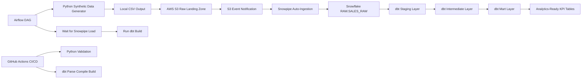

# Synthetic Sales ELT Pipeline


## Overview

This project is a production-style **synthetic sales ELT pipeline** built to demonstrate practical Data Engineering and Analytics Engineering capabilities.

The pipeline generates synthetic sales transaction data using Python, lands the data in AWS S3, auto-ingests new files into Snowflake using Snowpipe, and transforms the raw data into analytics-ready models using dbt.

It also includes Airflow orchestration, dbt tests, source freshness checks, load reconciliation, Snowflake workload isolation, and GitHub Actions CI/CD.

## Why This Project Exists

This project was built as a portfolio-grade data engineering implementation to demonstrate:

* Cloud-based raw data landing with AWS S3
* Event-driven ingestion into Snowflake using Snowpipe
* Modular transformation using dbt
* Layered data modeling with staging, intermediate, and marts
* Data quality checks and business reconciliation tests
* Airflow orchestration for end-to-end ELT execution
* GitHub Actions CI/CD for automated validation
* Secure credential handling using environment variables and GitHub Secrets

## Architecture



## End-to-End Data Flow

```text
Python Generator
    ↓
CSV File Created Locally
    ↓
Upload to AWS S3
    ↓
S3 Event Notification
    ↓
Snowpipe Auto-Ingest
    ↓
Snowflake RAW Layer
    ↓
dbt Staging Layer
    ↓
dbt Intermediate Layer
    ↓
dbt Mart Layer
    ↓
Sales KPI Tables
```

## Technology Stack

| Category         | Technology           |
| ---------------- | -------------------- |
| Programming      | Python 3.11          |
| Data Generation  | pandas, numpy, faker |
| Cloud Storage    | AWS S3               |
| Ingestion        | Snowpipe             |
| Data Warehouse   | Snowflake            |
| Transformation   | dbt                  |
| Orchestration    | Apache Airflow       |
| Containerization | Docker Compose       |
| CI/CD            | GitHub Actions       |
| Version Control  | Git / GitHub         |

## Business Use Case

The project simulates a sales analytics pipeline for an e-commerce or retail-style business.

The generated data includes transaction-level sales records with:

* Order ID
* Customer ID
* Product ID
* Product category
* Order timestamp
* Quantity
* Unit price
* Gross amount
* Discount amount
* Net amount
* Payment method
* Order status
* Batch ID
* Source file metadata
* Load timestamp

The transformed mart models support business reporting such as:

* Daily sales performance
* Completed vs pending vs cancelled vs refunded orders
* Net sales amount
* Average order value
* Discount rate
* Customer-level sales behavior
* File-level load reconciliation

## Default Project Configuration

The current default configuration generates synthetic sales data and uploads it to AWS S3.

```python
BUCKET_NAME = "vinski-synthetic-data-bucket"
NUM_RECORDS = 100000
OUTPUT_PREFIX = "sales"
REGION = "ap-southeast-1"
```

Generated files are written to S3 using a partition-style path:

```text
s3://vinski-synthetic-data-bucket/sales/raw/year=YYYY/month=MM/day=DD/file.csv
```

## Project Structure

```text
synthetic-data-generator/
│
├── dags/
│   └── synthetic_sales_s3_dag.py
│
├── pipeline/
│   ├── __init__.py
│   └── sales_pipeline.py
│
├── dbt_project/
│   ├── dbt_project.yml
│   ├── selectors.yml
│   │
│   ├── macros/
│   │   └── generate_schema_name.sql
│   │
│   ├── models/
│   │   ├── staging/
│   │   │   ├── src_sales.yml
│   │   │   └── stg_sales.sql
│   │   │
│   │   ├── intermediate/
│   │   │   ├── intermediate.yml
│   │   │   └── int_sales_enriched.sql
│   │   │
│   │   └── marts/
│   │       ├── fct_sales.sql
│   │       ├── mart_sales_daily_kpi.sql
│   │       ├── mart_customer_sales_kpi.sql
│   │       ├── mart_load_audit.sql
│   │       ├── marts.yml
│   │       └── exposures.yml
│   │
│   └── tests/
│       ├── assert_sales_amounts_reconcile.sql
│       └── assert_load_audit_matched.sql
│
├── .github/
│   └── workflows/
│       ├── ci.yml
│       └── dbt_deploy.yml
│
├── output/
├── config.py
├── main.py
├── requirements.txt
├── Dockerfile
├── docker-compose.yaml
├── .env.example
├── .gitignore
└── README.md
```

## Data Model

The project follows a layered dbt model design.

```text
RAW.SALES_RAW
    ↓
STAGING.STG_SALES
    ↓
INTERMEDIATE.INT_SALES_ENRICHED
    ↓
MARTS.FCT_SALES
    ↓
MARTS.MART_SALES_DAILY_KPI
    ↓
MARTS.MART_CUSTOMER_SALES_KPI
    ↓
MARTS.MART_LOAD_AUDIT
```

## dbt Layering Strategy

### 1. Raw Layer

The raw layer is populated by Snowpipe.

Table:

```text
SYNTHETIC_DATA.RAW.SALES_RAW
```

Purpose:

* Store Snowpipe-loaded files from S3
* Preserve source-level records
* Capture file metadata
* Capture load timestamp
* Keep raw ingestion separate from transformation logic

### 2. Staging Layer

Model:

```text
STAGING.STG_SALES
```

Purpose:

* Standardize column names
* Cast data types
* Normalize text values
* Deduplicate records
* Create a stable transaction event key
* Preserve source metadata

Example business key strategy:

```text
sales_event_key = md5(order_id + batch_id + source_file_name)
```

This avoids treating `order_id` alone as globally unique because each generated file may restart order IDs from 1.

### 3. Intermediate Layer

Model:

```text
INTERMEDIATE.INT_SALES_ENRICHED
```

Purpose:

* Apply reusable business logic
* Calculate discount rate
* Derive order month
* Add completed order flag
* Add failed or reversed order flag
* Prepare enriched transaction data for mart models

### 4. Mart Layer

Models:

```text
MARTS.FCT_SALES
MARTS.MART_SALES_DAILY_KPI
MARTS.MART_CUSTOMER_SALES_KPI
MARTS.MART_LOAD_AUDIT
```

Purpose:

* Provide transaction-level fact data
* Provide daily sales KPI reporting
* Provide customer-level sales metrics
* Reconcile raw file row counts against fact table row counts

## Snowflake Workload Isolation

The project uses separate Snowflake warehouses to isolate development, transformation, and mart workloads.

```text
WH_DBT_DEV         → local development, dbt debug, CI validation
WH_DBT_TRANSFORM   → staging and intermediate models
WH_DBT_MARTS       → facts, dimensions, KPI marts
```

This design provides cost visibility and workload separation without over-engineering the project.

## Data Quality Checks

The project includes dbt tests for both technical and business quality.

## Late-Arriving Data Simulation

This project includes a late-arriving data simulation to demonstrate how the pipeline handles records that arrive today but belong to older business dates.

In real-world data pipelines, late-arriving data can happen when source systems delay file delivery, retry failed batches, or send corrections for prior business periods. This project simulates that scenario by generating a file that lands in S3 today while the `order_timestamp` values are intentionally backdated.

### Late-Arriving Data Flow

```text
late_arriving.py
    ↓
Generate historical order timestamps
    ↓
Validate synthetic sales data
    ↓
Save late-arriving CSV locally
    ↓
Upload file to S3 sales/raw/
    ↓
Snowpipe auto-ingests the file
    ↓
dbt incremental fact model processes by load_ts
    ↓
Historical KPI dates are updated
```

### Why This Matters

The file arrival date and business event date are different.

Example:

```text
File arrival date: 2026-06-09
S3 path: sales/raw/year=2026/month=06/day=09/
Order timestamps: 2026-05-10 to 2026-06-01
```

This means the file lands in today’s S3 partition, but the actual sales transactions belong to prior reporting dates.

### Run Late-Arriving Data Simulation

From the project root:

```powershell
cd C:\dev\synthetic-data-generator
python late_arriving.py
```

Expected output:

```text
Starting late-arriving sales data simulation...
Generated late-arriving records: 5,000
Min order timestamp: 2026-05-10 00:08:38
Max order timestamp: 2026-06-01 23:57:17
Data validation passed.
Late-arriving CSV file created: output\sales_late_arriving_YYYYMMDD_HHMMSS.csv
Uploaded to S3: s3://vinski-synthetic-data-bucket/sales/raw/year=YYYY/month=MM/day=DD/sales_late_arriving_YYYYMMDD_HHMMSS.csv
Late-arriving data simulation completed successfully.
```

### Validate Snowpipe Loaded the Late File

Run in Snowflake:

```sql
SELECT
    SOURCE_FILE_NAME,
    COUNT(*) AS row_count,
    MIN(ORDER_TIMESTAMP) AS min_order_timestamp,
    MAX(ORDER_TIMESTAMP) AS max_order_timestamp,
    MAX(LOAD_TS) AS latest_load_ts
FROM SYNTHETIC_DATA.RAW.SALES_RAW
WHERE SOURCE_FILE_NAME ILIKE '%late_arriving%'
GROUP BY SOURCE_FILE_NAME
ORDER BY latest_load_ts DESC;
```

Expected result:

```text
ROW_COUNT = 5000
ORDER_TIMESTAMP values are historical
LOAD_TS is recent
```

### Run dbt After Late Data Arrives

After Snowpipe loads the file, run:

```powershell
cd C:\dev\synthetic-data-generator\dbt_project
dbt build --selector transform_pipeline --no-partial-parse
```

### Validate Late Data Reached the Fact Table

```sql
SELECT
    SOURCE_FILE_NAME,
    COUNT(*) AS fact_row_count,
    MIN(ORDER_DATE) AS min_order_date,
    MAX(ORDER_DATE) AS max_order_date,
    MAX(LOAD_TS) AS latest_load_ts
FROM SYNTHETIC_DATA.MARTS.FCT_SALES
WHERE SOURCE_FILE_NAME ILIKE '%late_arriving%'
GROUP BY SOURCE_FILE_NAME
ORDER BY latest_load_ts DESC;
```

Expected result:

```text
FACT_ROW_COUNT = 5000
ORDER_DATE values are historical
LOAD_TS is recent
```

### Validate Historical KPI Dates Were Updated

```sql
SELECT
    ORDER_DATE,
    TOTAL_ORDERS,
    COMPLETED_ORDERS,
    NET_SALES_AMOUNT,
    LATEST_LOAD_TS
FROM SYNTHETIC_DATA.MARTS.MART_SALES_DAILY_KPI
WHERE ORDER_DATE BETWEEN CURRENT_DATE - 30 AND CURRENT_DATE - 7
ORDER BY LATEST_LOAD_TS DESC
LIMIT 20;
```

This confirms that historical business dates are updated when late-arriving records are processed.

### Late-Arriving Data Design Pattern

The dbt fact model uses `load_ts` for incremental processing instead of filtering only on `order_date`.

This is important because filtering only by business date can miss records that arrive late but belong to older reporting periods.

Recommended pattern:

```text
Use load timestamp for incremental ingestion logic.
Use business date for reporting and KPI aggregation.
```

### Interview Explanation

I simulated late-arriving data by generating sales files that land in S3 today but contain historical order timestamps. Snowpipe ingests the file based on arrival time, while dbt processes the data using the load timestamp. This allows the pipeline to capture late-arriving records and update historical KPI dates correctly.

This pattern is important because real production pipelines often receive delayed files, retries, or corrections from source systems. By using `load_ts` for incremental processing and `order_date` for business reporting, the pipeline avoids missing late-arriving events.


### Technical Data Quality

* Not-null checks
* Unique key checks
* Accepted values checks
* Source freshness checks

### Business Data Quality

* Gross amount reconciliation
* Net amount reconciliation
* Raw-to-fact row count reconciliation
* Source file load audit

Example validations:

```text
gross_amount = quantity * unit_price
net_amount = gross_amount - discount_amount
raw_row_count = fact_row_count
order_status IN ('COMPLETED', 'PENDING', 'CANCELLED', 'REFUNDED')
```

## Load Reconciliation

The `mart_load_audit` model validates whether each Snowpipe-loaded file is represented correctly in the transformed fact table.

It compares:

```text
RAW.SALES_RAW row count by source_file_name
        vs
MARTS.FCT_SALES row count by source_file_name
```

Expected result:

```text
RECONCILIATION_STATUS = MATCHED
```

Example query:

```sql
SELECT *
FROM SYNTHETIC_DATA.MARTS.MART_LOAD_AUDIT
ORDER BY LAST_LOADED_AT DESC;
```

Summary validation:

```sql
SELECT
    COUNT(*) AS total_files,
    SUM(raw_row_count) AS total_raw_rows,
    SUM(fact_row_count) AS total_fact_rows,
    SUM(row_count_difference) AS total_difference
FROM SYNTHETIC_DATA.MARTS.MART_LOAD_AUDIT;
```

Expected:

```text
TOTAL_DIFFERENCE = 0
```

## Airflow Orchestration

Airflow orchestrates the ELT workflow.

DAG:

```text
synthetic_sales_full_elt
```

Task flow:

```text
generate_task
    ↓
validate_task
    ↓
upload_task
    ↓
wait_for_snowpipe_task
    ↓
dbt_build_task
```

Optional observability task:

```text
dbt_source_freshness_task
```

During development, source freshness can be treated as a monitoring task instead of a blocking step. Once ingestion timing is stable, it can be promoted into a blocking data quality gate.

## GitHub Actions CI/CD

The project includes GitHub Actions workflows for automated validation.

### CI Workflow

File:

```text
.github/workflows/ci.yml
```

Purpose:

* Install Python 3.11
* Install project dependencies
* Validate Python modules
* Generate dbt `profiles.yml` from GitHub Secrets
* Run `dbt debug`
* Run `dbt parse`
* Run `dbt compile`
* Run `dbt build --empty`

### CD Workflow

File:

```text
.github/workflows/dbt_deploy.yml
```

Purpose:

* Run dbt build against Snowflake
* Validate dbt models after merge to main
* Support manual deployment through `workflow_dispatch`

## Security and Credential Handling

Credentials are not hardcoded in the project.

The project uses:

* `.env` for local Docker/Airflow development
* PowerShell environment variables for local dbt testing
* GitHub Secrets for CI/CD
* Snowflake storage integrations for secure S3 access
* AWS IAM roles and policies for least-privilege access

Do not commit:

```text
.env
set_env.ps1
venv/
venv311/
output/
logs/
dbt_project/target/
dbt_project/logs/
dbt_project/dbt_packages/
```

## GitHub Secrets

Configure these in:

```text
GitHub Repository → Settings → Secrets and variables → Actions → Secrets
```

Required secrets:

```text
SNOWFLAKE_ACCOUNT
SNOWFLAKE_USER
SNOWFLAKE_PASSWORD
SNOWFLAKE_ROLE
SNOWFLAKE_WAREHOUSE
SNOWFLAKE_DATABASE
```

Recommended values:

```text
SNOWFLAKE_ACCOUNT=CYOVZFT-UF47725
SNOWFLAKE_ROLE=SYSADMIN
SNOWFLAKE_WAREHOUSE=WH_DBT_DEV
SNOWFLAKE_DATABASE=SYNTHETIC_DATA
```

The `SNOWFLAKE_ACCOUNT` value should contain only the account identifier.

Use:

```text
CYOVZFT-UF47725
```

Do not use:

```text
https://CYOVZFT-UF47725.snowflakecomputing.com
CYOVZFT-UF47725.ap-southeast-1.aws
```

## Local Setup

### 1. Clone the Repository

```powershell
git clone https://github.com/vinski-dev/synthetic-data-generator.git
cd synthetic-data-generator
```

### 2. Create Python Virtual Environment

```powershell
py -3.11 -m venv venv311
.\venv311\Scripts\Activate.ps1
python -m pip install --upgrade pip
python -m pip install -r requirements.txt
```

### 3. Configure Local Environment Variables

Create a `.env` file in the project root.

```env
AIRFLOW_UID=50000

AWS_ACCESS_KEY_ID=your_aws_access_key
AWS_SECRET_ACCESS_KEY=your_aws_secret_key
AWS_DEFAULT_REGION=ap-southeast-1

SNOWFLAKE_ACCOUNT=your_snowflake_account_identifier
SNOWFLAKE_USER=your_snowflake_username
SNOWFLAKE_PASSWORD=your_snowflake_password
SNOWFLAKE_ROLE=SYSADMIN
SNOWFLAKE_WAREHOUSE=WH_DBT_DEV
SNOWFLAKE_DATABASE=SYNTHETIC_DATA
```

## Running the Pipeline Manually

Generate synthetic sales data and upload to S3:

```powershell
python main.py
```

Expected behavior:

```text
Generate 100,000 synthetic sales records
Validate generated data
Write CSV to output folder
Upload CSV to S3
```

## Running dbt Locally

Go to the dbt project folder:

```powershell
cd dbt_project
```

Run dbt debug:

```powershell
dbt debug --no-partial-parse
```

Parse project:

```powershell
dbt parse --no-partial-parse
```

Build dbt models:

```powershell
dbt build --selector transform_pipeline --no-partial-parse
```

Run source freshness:

```powershell
dbt source freshness --no-partial-parse
```

Generate dbt docs:

```powershell
dbt docs generate
dbt docs serve
```

## Running Airflow Locally

Start Airflow using Docker Compose:

```powershell
docker compose up -d --build
```

Check containers:

```powershell
docker compose ps
```

View scheduler logs:

```powershell
docker compose logs -f airflow-scheduler
```

Open Airflow UI:

```text
http://localhost:8080
```

Default login:

```text
Username: airflow
Password: airflow
```

Stop Airflow:

```powershell
docker compose down
```

## Snowflake Validation Queries

Check raw load:

```sql
SELECT
    SOURCE_FILE_NAME,
    COUNT(*) AS row_count,
    MIN(LOAD_TS) AS first_loaded_at,
    MAX(LOAD_TS) AS last_loaded_at
FROM SYNTHETIC_DATA.RAW.SALES_RAW
GROUP BY SOURCE_FILE_NAME
ORDER BY last_loaded_at DESC;
```

Check dbt model row counts:

```sql
SELECT COUNT(*) AS staging_count
FROM SYNTHETIC_DATA.STAGING.STG_SALES;

SELECT COUNT(*) AS intermediate_count
FROM SYNTHETIC_DATA.INTERMEDIATE.INT_SALES_ENRICHED;

SELECT COUNT(*) AS fact_count
FROM SYNTHETIC_DATA.MARTS.FCT_SALES;
```

Check daily KPI mart:

```sql
SELECT *
FROM SYNTHETIC_DATA.MARTS.MART_SALES_DAILY_KPI
ORDER BY ORDER_DATE DESC
LIMIT 20;
```

Check customer KPI mart:

```sql
SELECT *
FROM SYNTHETIC_DATA.MARTS.MART_CUSTOMER_SALES_KPI
ORDER BY COMPLETED_NET_SALES_AMOUNT DESC
LIMIT 20;
```

Check load audit:

```sql
SELECT *
FROM SYNTHETIC_DATA.MARTS.MART_LOAD_AUDIT
ORDER BY LAST_LOADED_AT DESC;
```

## Troubleshooting

### Docker command not recognized

```text
docker: The term 'docker' is not recognized
```

Fix:

* Install Docker Desktop
* Start Docker Desktop
* Restart PowerShell
* Validate:

```powershell
docker --version
docker compose version
```

### Airflow cannot import pipeline module

```text
ModuleNotFoundError: No module named 'pipeline'
```

Fix:

* Confirm `pipeline/` is mounted in `docker-compose.yaml`
* Confirm `PYTHONPATH=/opt/airflow`
* Restart Airflow:

```powershell
docker compose down
docker compose up -d --build
```

### dbt profiles.yml not found in GitHub Actions

Fix:

* Generate `profiles.yml` inside the GitHub Actions workflow
* Use GitHub Secrets for Snowflake credentials
* Run dbt commands with:

```text
--profiles-dir .
```

### Snowflake account identifier error

Use only the account identifier:

```text
CYOVZFT-UF47725
```

Do not include dots, slashes, region, URL, or `snowflakecomputing.com`.

### dbt source freshness failed

Check latest raw load:

```sql
SELECT
    COUNT(*) AS row_count,
    MAX(LOAD_TS) AS latest_load_ts,
    DATEDIFF('hour', MAX(LOAD_TS), CURRENT_TIMESTAMP()) AS hours_since_latest_load
FROM SYNTHETIC_DATA.RAW.SALES_RAW;
```

For development, use a relaxed freshness SLA. Once the ingestion schedule is stable, tighten the freshness rule.

### Snowpipe did not load files

Check pipe status:

```sql
SELECT SYSTEM$PIPE_STATUS('SYNTHETIC_DATA.RAW.SALES_AUTO_PIPE');
```

Check files in stage:

```sql
LIST @SYNTHETIC_DATA.RAW.SALES_S3_STAGE;
```

Refresh recent staged files:

```sql
ALTER PIPE SYNTHETIC_DATA.RAW.SALES_AUTO_PIPE REFRESH;
```

## Current Implementation Status

Implemented:

* Python synthetic sales data generator
* Local CSV output
* AWS S3 upload
* Snowpipe auto-ingestion
* Snowflake raw table
* dbt staging model
* dbt intermediate model
* dbt mart models
* dbt tests
* Source freshness
* Load audit mart
* Airflow orchestration
* GitHub Actions CI/CD

## Backfill Workflow

This project includes a manual backfill workflow for generating historical sales data and loading it through the same S3, Snowpipe, Snowflake, and dbt transformation path.

Backfill files are uploaded under:

```text
sales/raw/backfill/business_date=YYYY-MM-DD/
## Future Enhancements

Potential next improvements:

* Add Terraform for AWS and Snowflake infrastructure
* Add Slack or email alerting for Airflow failures
* Add Power BI, Tableau, or Streamlit dashboard
* Add dbt Cloud deployment job
* Add dimensional date and product models
* Add Great Expectations or Soda data quality checks
* Add data lineage screenshots from dbt docs
* Add cost monitoring queries for Snowflake warehouses

## Interview-Ready Summary

I built an end-to-end ELT pipeline that generates synthetic sales data using Python, lands the files in AWS S3, auto-ingests them into Snowflake using Snowpipe, and transforms the raw data into analytics-ready models using dbt.

Airflow orchestrates the workflow from data generation to transformation, while GitHub Actions provides CI/CD validation. The dbt project includes staging, intermediate, and mart layers, along with data quality tests, source freshness checks, and load reconciliation to ensure the final KPI tables are reliable and business-ready.
